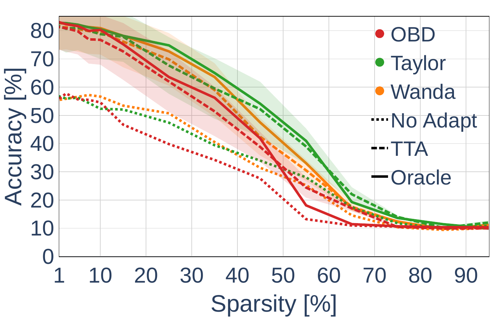
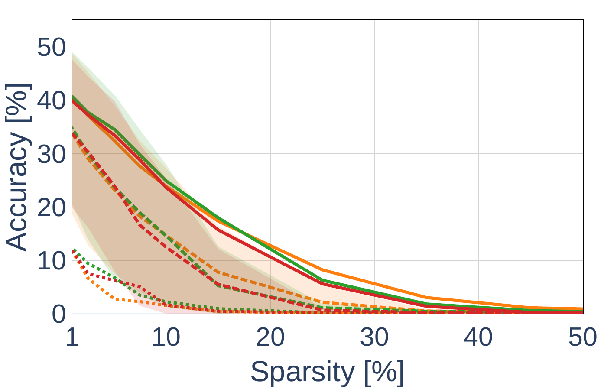
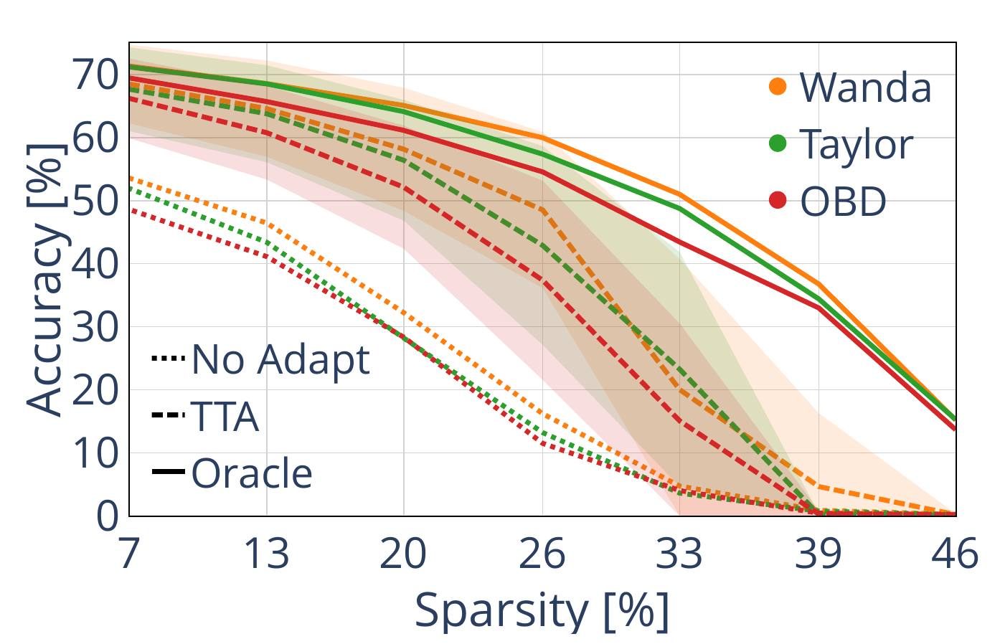

# On the Interaction Between Model Compression and Test-Time Adaptation

We study how structured model compression interacts with test-time adaptation (TTA). Deep neural networks deployed in the wild must be both efficient and adaptable, yet compression and adaptation are studied in isolation. We compress [ResNet-18](https://arxiv.org/abs/1512.03385) and [ViT-Base](https://arxiv.org/abs/2010.11929) with five structured criteria, [Wanda](https://openreview.net/forum?id=PxoFut3dWW), [Taylor](https://arxiv.org/abs/1906.10771), [Optimal Brain Damage](https://proceedings.neurips.cc/paper/1989/hash/6c9882bbac1c7093bd25041881277658-Abstract.html), magnitude pruning and [model folding](https://openreview.net/forum?id=W2Wkp9MQsF), and adapt them on [CIFAR-10-C](https://zenodo.org/records/2535967) and [ImageNet-C](https://zenodo.org/records/2235448) with [SAR](https://openreview.net/forum?id=g2YraF75Tj) and [SPA](https://openreview.net/forum?id=Li4rieeClO), comparing each TTA method against a matched supervised Oracle that shares its optimizer, trainable parameters, learning rate and number of steps and differs only in the loss. Although compressed models retain high accuracy under supervised adaptation, their TTA accuracy degrades with increasing compression. A diagnostic framework based on representational expressivity (worst-layer CKA, activation-map entropy) and adaptation-subspace compatibility (gradient cosine similarity, objective-induced gradient degeneracy) traces this loss of adaptability to reduced representational diversity and to a vanishing or misaligned TTA gradient.

## Software prerequisites

Install the software packages required for reproducing the experiments by running the command `pip3 install -r requirements.txt` inside the project folder.

The compute, memory and latency profiling additionally requires the profiler of [Slamanig et al. (2025)](https://github.com/gslama12/pytorch-model-profiler): `pip3 install git+https://github.com/gslama12/pytorch-model-profiler@main`.

## Data and checkpoints

* [CIFAR-10-C](https://zenodo.org/records/2535967) and [ImageNet-C](https://zenodo.org/records/2235448), extracted as `<root>/<corruption>/<severity>/`. The ImageNet experiments also require the ImageNet-1k validation set.
* ViT-Base on ImageNet uses the pretrained `vit_base_patch16_224` model of [timm](https://github.com/huggingface/pytorch-image-models) (`--encoder_name`); the additional `augreg_in1k` and `sam_in1k` checkpoints of the multi-checkpoint experiments are fetched with `python3 download_timm_checkpoints.py`. ResNet-18 on ImageNet uses the [torchvision](https://pytorch.org/vision/stable/models.html) checkpoint.
* ResNet-18 on CIFAR-10 is trained from scratch with `train_resnet18_cifar10.py` (200 epochs, SGD with momentum 0.9, learning rate 0.1, weight decay 5e-4, cosine schedule, batch size 128).
* The smaller-dense reference models of the scale study are trained with `train_smaller_rn18_cifar10.py` and `train_smaller_rn18_imagenet.py`.

```
python3 train_resnet18_cifar10.py --seed 0 --data_root path/to/data --save_dir pretrained
```

Dataset and checkpoint locations are passed explicitly to every program (`--data_root_*`, `--corruptions_root_*`, `--checkpoints_root`). For each program, the GPU is selected with `--cuda_device`; results are written as per-cell JSON files and run logs and printed to the screen.

## Compression and test-time adaptation

One program per architecture and dataset pair runs the full sparsity ratios for one compression criterion and one adaptation method. The compression criterion is selected with `--method {wanda, taylor, hessian, mag-l2, fold}`, where `hessian` is Optimal Brain Damage and `fold` is model folding. For the ResNet-18 programs the adaptation method is `--tta_method {sar, oracle, tent, pea_resnet18}`, where `oracle` is the matched supervised Oracle-SAR; for ViT-Base it is `--tta_method {spa, oracle_spa, pea_vit, foa}`, where `oracle_spa` is the matched Oracle-SPA and `pea_*`, `foa` are the backpropagation-free methods. After every compression step at a non-zero ratio the ResNet-18 programs re-estimate the BatchNorm statistics on four training batches (REPAIR); ViT-Base uses LayerNorm and needs no re-estimation.

**ResNet-18 on CIFAR-10-C**

```
python3 resnet18_cifar10_pruning.py --method wanda --tta_method sar --severity 5
python3 resnet18_cifar10_pruning.py --method wanda --tta_method oracle --severity 5
```

**ResNet-18 on ImageNet-C**

```
python3 resnet18_imagenet_tta_pruning.py --method taylor --tta_method sar --severity 5
```

**ViT-Base on ImageNet-C**

```
python3 vit_tta_model_compression.py --method fold --tta_method spa --severity 5
python3 vit_tta_model_compression.py --method fold --tta_method oracle_spa --severity 5
```

Multi-seed runs receive the checkpoints as a comma-separated list, `--checkpoints ckpt0.pth,ckpt1.pth,ckpt2.pth`.

## Diagnostic framework

`run_diagnostic_metrics.py` computes one cell of the diagnostic grid, identified by architecture, dataset, scheme, adaptation method, compression criterion, compression ratio, seed, severity and phase (before or after adaptation), and writes a single JSON file with the worst-layer CKA to the dense model, the activation-map entropy (AME), the spectral-ratio pseudo-distance d_SR of the metric similarity analysis and the prediction entropy:

```
python3 run_diagnostic_metrics.py \
    --arch rn18 --dataset cifar10 \
    --scheme dense_prune_tta \
    --adapt SAR --method fold --compression_ratio 0.15 --seed 0 \
    --severity 5 --phase POST \
    --checkpoints_root path/to/checkpoints \
    --data_root_cifar path/to/data --corruptions_root_cifar path/to/CIFAR-10-C
```

`--scheme smaller_dense_tta` evaluates the smaller-dense reference models of the scale study and `--acc_only` restricts the cell to the post-adaptation accuracy. The remaining analyses of the paper are run as follows:

```
python3 compute_prediction_entropy.py --method wanda                     # prediction entropy H(p), ResNet-18 on CIFAR-10-C
python3 compute_prediction_entropy_imagenet.py --method wanda            # prediction entropy H(p), ResNet-18 on ImageNet-C
python3 compute_prediction_entropy_vit_imagenet.py --method wanda        # prediction entropy H(p), ViT-Base on ImageNet-C
python3 compute_dense_ame_references.py --arch rn18 --dataset cifar10    # AME reference vectors of the dense model
python3 gradient_alignment_ablation.py                              # gradient alignment without the confident-but-wrong samples
python3 cpu_profile_compute_overheads.py                            # memory, latency and FLOPs of the compressed models
```

All quantitative results in the paper are computed from the JSON files and run logs written by these programs.

## Results

Post-compression accuracy of test-time adaptation (dashed), of the matched supervised Oracle (solid) and without adaptation (dotted) as a function of sparsity, averaged over the 15 corruptions at severity 5. From left to right: ResNet-18 on CIFAR-10-C, ResNet-18 on ImageNet-C and ViT-Base on ImageNet-C (data-dependent criteria Wanda, Taylor and OBD). The gap between the Oracle and TTA widens with increasing compression, most strongly on ImageNet-C.

  

## BibTeX

If you found this repository useful, please consider citing our work.

```
@inproceedings{corti2026interactionmodelcompressiontesttime,
  title     = {On the Interaction Between Model Compression and Test-Time Adaptation},
  author    = {Corti, Francesco and Wang, Dong and Kwon, Young D. and Mascolo, Cecilia and Saukh, Olga},
  booktitle = {Conference on Lifelong Learning Agents (CoLLAs)},
  year      = {2026}
}
```
